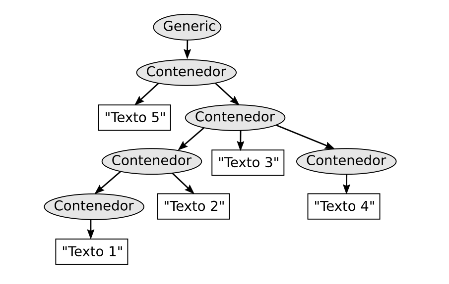
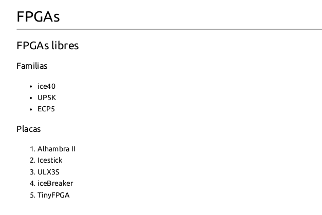

# Parcial LTAW. 23-Marzo-2021

Notas: unas 20 preguntas. 4 de cada sesión

## Pregunta 1. S1. Lenguajes de marcado

¿Cual es la misión de un analizador sintáctico aplicado a un documento de marcado?

### Solución

Comprobar que el documento es sintácticamente correcto y crear la estructura de datos en árbol que representa a ese documento

## Pregunta 2. S1. SGML

Dado el siguiente documento en SGML:

```xml


<!DOCTYPE urjc_ML SYSTEM "urjc_ml.dtd">
<urjc_ml>
  <!-- Define campus = root-tag -->
  <campus>
    <nombre>Campus de Fuenlabrada</nombre>
    <escuela>
      <nombre>ETSI Telecomunicación</nombre>
      <grado>
        <nombre>Ingeniería en Sistemas Audiovisuales y Multimedia </nombre>
        <asignatura>Laboratorio de Tecnologias Audiovisuales en la Web</asignatura>
        <asignatura>Construcción de servicios y Aplicaciones Audiovisuales en Internet</asignatura>
      </grado>
    </escuela>
  </campus>
</urjc_ml>


```

* Indica cuál es la etiqueta raiz del documento
* Indica qué etiquetas están en el nivel 3 de profundidad

### Solución

* La etiqueta raiz es urjc_ml
* Las etiquetas del nivel 3 son:  nombre y asignatura

## Pregunta 3. S1.SGML



Este arbol representa la estructura del tipo de documento **generic**, que está definido en el archivo llamado **generic.dtd**. Los **nombres de las etiquetas** de cada elemento del árbol están escritos en los nodos ovalados. Estos **nombres son válidos** y se encuentra definidos dentro del **documento DTD**. Escribe el documento SGML que representa esta estructura

### Solución

```xml
<!DOCTYPE generic SYSTEM "generic.dtd">
<Generic>
  <Contenedor>
    Texto 5
    <Contenedor>
      <Contenedor>
        <Contenedor>Texto 1</Contenedor>
        Texto 2
      </Contenedor>
      Texto 3
      <Contenedor>
        Text 4
      </Contenedor>
    </contenedor>
  </Contenedor>
</Generic>
```

## Pregunta 4. Markdown

Escribe un documento en markdown que produzca la siguiente salida



### Solución

```md
# FPGAs

## FPGAs libres

### Familias

* ice40
* UP5K
* ECP5

### Placas

1. Alhambra II
2. Icestick
3. ULX3S
4. iceBreaker
5. TinyFPGA
```

## Pregunta 5. S2. Servidor

Indica cuáles son las operaciones básicas que realiza un servidor web

### Solución

Las tres operaciones principales del servidor son:

* Procesar la petición HTTP
* Obtener el rescurso pedido
* Generar el mensaje de respuesta y enviarlo al cliente

## Pregunta 6. S2. Programación asíncrona

Explica en qué consiste la programación asíncrona y qué ventaja tiene a la hora de programar servidores web

### Solución

En la programación asíncrona no se espera a que una tarea termine para iniciar la siguiente, sino que se inicia y se configura para que se llame a una función de retrollamda cuando ha terminado. En paralelo se continua con las siguientes tareas

Tiene la ventana de que reduce los tiempos de espera, ya que se hacen operaciones en background. Esto hace que el servidor tenga un mejor rendimiento

## Pregunta 7. S2. node.js

Explica de forma general lo que hace el siguiente código:
(No lo expliques línea a línea, sino en su totalidad)

```js

const http = require('http');
const server = http.createServer((req, res) => {
  res.write("Hola\n");
  res.end();
});

server.listen(8080);

```

### Solución

Este programa recibe peticiones HTTP y genera un mensaje de respuesta que contiene "hola" en el cuerpo. Su comportamiento es el mismo para cualquier petición recibida (es un happy server)

## Pregunta 8. S2. Cliente web

Explica para qué sirve la herramienta curl

### Solución

curl es una herramienta de la línea de comandos para realizar peticiones HTTP a servidores

## Pregunta 9. S3. URL

Indica los diferenes campos de una URL y pon un ejemplo de una que contenga todos

### Solución

La URL está formada por la unión de varios campos:

* Protocolo
* Host
* Recurso
* Fragmento

El resurso a su vez está formado por la ruta y la búsqueda

Ej.  http://localhost:8080/mi_tienda/listado.html?articulo=pendrive#descripción

* Protocolo: http
* Host: localhost:8080
* Recurso: /mi_tienda/listado.html?articulo=pendrive
  * Ruta: /mi_tienda/listado.html
  * Búsqueda: articulo=pendrive
* Fragmento: descripcion


## Pregunta 10. S3. Modulo http

Dado el siguiente código, indica el orden de escritura de los mensajes en la consola al arrancar el servidor y recibir una petición que tiene datos en el cuerpo del mensaje de solicitud

```js

const http = require('http');

const server = http.createServer((req, res) => {
  console.log("\nMENSAJE A")

  req.on('data', (cuerpo) => {
    console.log("MENSAJE B")
  });

  req.on('end', ()=> {
    console.log("MENSAJE C");
    res.setHeader('Content-Type', 'text/plain');
    res.write("Soy el happy server\n");
    res.end()
  });

console.log("MENSAJE D");
});

console.log("MENSAJE E");
server.listen(8080);
console.log("MENSAJE F");

```


### Solución

Dado que esto es programación asíncrona, el ordenan de escritura en la consola está determinado por las funciones de retrollamada. Según acaban una tareas se van realizando las impresiones

* Mensaje E
* Mensaje F
* Mensaje A
* Mensaje D
* Mensaje B
* Mensaje C


## Pregunta 11. S3. HTTP

Un cliente realiza una petición HTTP para acceder a un servidor web. Si el recurso que solicita el cliente es una página html, explica si el servidor debe indicar algo en la cabecera del mensaje de respuesta

### Solucion

El servidor siempre debe incluir en el mensaje de respuesta la cabecera `Content-Type:` indicando el tipo de contenido que lleva en el cuerpo. Si se trata de un documento html debe especificar que es de tipo `text/html`

## Pregunta 12. S3. Modulo fs

Dado el siguiente código, indica el orden de escritura de los mensajes en la consola al ejecutar el programa

```js

const fs = require('fs');
console.log("Mensaje A");
const data1 = fs.readFileSync('fich1.txt','utf8');
console.log("Mensaje B");
const data2 = fs.readFileSync('fich2.txt', 'utf8');
console.log("Mensaje C");

```

### Solución

En este programa se está utilizando el módulo fs para leer ficheros del sistema de ficheros. Como se está utilizando el método readFileSync, las lecturas son síncronas. Es decir, que hasta que no termina una no empieza la siguiente. Por tanto el orden de escritura en la consola es el esperado:

* Mensaje A
* Mensaje B
* Mensaje C

## Pregunta 13. S4. XML

Explica cuáles son los usos principales del lenguaje XML

### Solución

XML nos permite estructurar los datos bien para almacenarnos o bien para intercambiarlos entre aplicaciones. Entra los usos de almacenamiento encontramos:

* Bases de datos
* Ficheros de proyecto
* Ficheros de configuración

## Pregunta 14. S4. XML. Valido

Dado el siguiente documento

```xml

<?xml version="1.0" encoding="UTF-8"?>

<!-- Estructura de mi tienda -->
<!-- Nodo raiz -->
<tienda>

  <!-- Mi tienda contiene productos/articulos -->
  <producto>
    Un producto
  </producto>

  <producto>
    Otro producto
  </producto>

</tienda>

```
* ¿Está bien formado?
* ¿Es válido?

### Solución

* El documento es sintácticamente correcto. Las etiquetas están escritas con su sintáxis adecuada y cada cada etiqueta de apertura hay una cierre

* Sin embargo no podemos saber si es válido o no porque no se ha especificado una gramática

## Pregunta 15. S4. XML. Gramática

Explica si en XML se puede definir una gramática, para qué nos sirve su definición y qué formas habría de definirla

### Solución

En XML se puede definir una gramática opcionalmente. El definirla nos permite que los analizadores comprueben si se trata de un documento válido o no. La gramática se puede definir de dos formas: utilizando ficheros dtd o bien mediante esquemas en XML (Ficheros .xsd)

## Pregunta 16. S4. Esquemas

Este documento se encuentra almacenado en el fichero test.xsd:

```xml

<?xml version="1.0" encoding="UTF-8"?>

<xs:schema xmlns:xs="http://www.w3.org/2001/XMLSchema">
    <xs:element name="tienda" type="xs:string">
    </xs:element>
</xs:schema>

```

Indica si este otro documento es válido o no:

```xml

<?xml version="1.0" encoding="UTF-8"?>

<tienda xmlns:xsi="http://www.w3.org/2001/XMLSchema-instance"
        xsi:noNamespaceSchemaLocation="test.xsd">
  <producto>
      Producto 1
  </producto>
</tienda>

```

### Solución

El documento NO es válido. En el esquema se está especificando que en este documento sólo puede existir el elemento tienda, que es una cadena. No puede contener otras etiquetas en su interior


## Pregunta 17. S5. Servidores web y HTTP

Explica algún otro uso del protocolo HTTP que no sea servir páginas web

### Solución

El protocolo HTTP se utiliza también para el intercambio de información entre un cliente y un servidor. En ese caso lo que se intercambian son documentos de datos, que típicamente van en formatos como el XML o el JSON

## Pregunta 18. S5. XML y JSON

Dado el siguiente documento en xML

```xml

<?xml version="1.0" encoding="UTF-8"?>

<tienda>
    <producto>
        <nombre>Alhambra II</nombre>
        <descripcion>Placa con FPGA ice40HX8K</descripcion>
        <stock>3</stock>
    </producto>

    <producto>
        <nombre>Icestick</nombre>
        <stock>10</stock>
    </producto>
</tienda>

```

Reescríbelo en formato JSON

### Solución

```json
[
  {
    "nombre": "Alhambra II",
    "descripción": "Placa con FPGA ice40HX8K",
    "stock": 3
  },
  {
    "nombre": "Icestick",
    "stock": 10
  }
]
```

## Pregunta 19. S5. JSON

Una tienda tiene una base de datos para almacenar la siguiente información:

* Productos: En la tienda hay varios productos. Cada producto tiene un campo nombre y otro precio
* Pedidos: Almacena todos los pedidos pendientes que hay. Cada pedido tiene un nombre de cliente (cliente) y una dirección de entrega (direccion)

Actualmente la situación de la tienda es que tiene sólo dos productos A y B, cuyos precios son 10 y 20 respectivamente. Hay un pedido pendiente, realizado por el usuario Chuck Norris cuya dirección es "Puedo vivir donde quiera"

Escribe el documento JSON que almacena esa base de datos en la situación actual

### Solución

```json
{
    "productos": [
        {
            "nombre": "A",
            "precio": 10
        },
        {
            "nombre": "B",
            "precio": 20
        }
    ],
    "pedidos": [
        {
            "cliente": "Chuck Norris",
            "Direccion": "puedo vivir donde quiera"  
        }
    ]
}
```

## Pregunta 20. S5. Variables y Json

Analiza el siguiente programa e indica qué información imprime en la consola

```js

const cad = `[
    {
      "A": {
          "a": [50, 30]
      },
      "D": "Soy A"
    },
    {
      "A": {
          "b": [33, 55]
      },
      "D": "Soy B"
    }
]`
  
  const f = JSON.parse(cad);
  console.log(f[1]["A"]["b"][0]);

```

### Solución:

El programa crea la variable f a partir de la estructura dada en una cadena JSON. Luego se accede al primer número de la propiedad b dentro de la propiedad A del segundo elemento, que vale 33. En la consola se escribe 33
